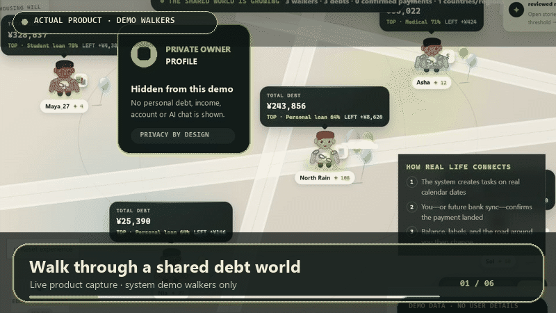

# Debt World · 上岸星球

> A shared, walkable world for honest debt journeys.  
> 一个会随着真实匿名数据不断生长的债务世界。

[Live beta](https://www.debtworld.org/en?src=githubreadme) · [23-second demo](#walk-the-world-in-23-seconds--23-秒看懂上岸星球) · [5-minute test](#test-debt-world-in-5-minutes--5-分钟体验) · [Roadmap](ROADMAP.md) · [Public build log](https://github.com/rback37/debt-world/issues/1) · [Contribute](CONTRIBUTING.md) · [Safety](https://www.debtworld.org/en/safety)

## Walk the world in 23 seconds · 23 秒看懂上岸星球

> Actual product capture. Every visible walker uses system demo data. No real user debt, income, account identity, or private AI conversation is shown.
>
> 真实产品画面。所有可见角色均为系统演示数据，不展示真实用户的债务、收入、账户身份或私人 AI 对话。

[**Start the 5-minute test**](https://www.debtworld.org/en?src=githubreadme) · [开始 5 分钟体验](https://www.debtworld.org/?src=githubreadme) · [Safety & privacy](https://www.debtworld.org/en/safety) · [中文安全说明](https://www.debtworld.org/safety)

## Test Debt World in 5 minutes · 5 分钟体验

1. Watch the walkthrough above and read the privacy boundary before registering.
2. Open the beta and create an anonymous username and password. No email, phone number, or legal name is required.
3. Choose a country and language, enter the shared world, and look around before deciding whether to enter financial information.
4. If you feel comfortable, privately add one truthful debt or cash-flow item. If you would rather not enter financial data, skip this step and test navigation, keyboard controls, language, readability, or accessibility instead.
5. Open **Feedback** in the product and answer one question: **During your first visit, which step felt most confusing, intrusive, or made you want to leave?**

中文：先看上方动图和隐私说明，再用匿名用户名注册。进入世界后可以先观察，不必立即填写财务信息；愿意时只录入一项真实且私密的负债或现金流，不愿填写也可以只测试地图、键盘、语言和可读性。最后在产品内的“反馈”入口回答：**第一次进入时，哪一步最让你困惑、不安或想退出？**

Please do not invent debt records just to test the form; fake records would distort future anonymous aggregates. Never post personal debt amounts, income, passwords, bank details, identity documents, or private AI conversations on GitHub.

## Why it exists

Social media can make ordinary people feel as if everyone else is rich. Debt World reverses that illusion. It helps people map real debt pressure, see repayment progress clearly, and discover that they are not alone.

上岸星球想反过来对抗“人均富豪”的网络错觉：把房贷、信用卡、学贷、医疗、经营、亲友借款等真实压力整理成匿名角色与现实进度，让普通人看见更接近真实的世界。

It is not a debt leaderboard and it does not promise a shortcut out. The goal is to make pressure legible, reduce isolation, and help people find realistic next steps.

## What the public beta can do

- Enter one shared world that grows as new anonymous debt patterns appear.
- Organize multiple debts through conversation or manual entry.
- Track balance, APR, minimum payment, due date, income, living costs, and confirmed payment updates.
- Compare highest-interest, smallest-balance, and cash-flow-safety repayment lenses.
- Turn debt sources and progress into visible burdens, chains, labels, light, balloons, and clouds.
- Explore a zoomable world of reviewed anonymous stories and send fixed, safe encouragement.
- Select a country and understand amounts in the selected currency.
- Add, adjust, export, or permanently delete account and character data.
- Use Chinese or English; more languages will follow real user cohorts and human review.

## Privacy and safety by design

- No legal name, phone number, government ID, bank card, or precise address is required.
- No bank is connected. Financial data is self-reported.
- Exact debt, income, expenses, passwords, and private AI conversations never enter the public map.
- Public stories require separate consent, sensitive-detail removal, and moderation.
- No stranger direct messages, lending, transfers, crowdfunding, collection leads, or paid debt-relief offers.
- Users can export account data, withdraw stories, and permanently delete their account and character.
- The sole owner admin sees operational counts, account status, submitted feedback, and moderation queues—not passwords or private AI conversations.

## What Kian AI does—and does not do

Kian can organize a free-form description into a draft, calculate simple interest references from user-entered rates, compare repayment lenses, and identify missing facts or next steps. Every draft must be confirmed by the user.

Kian is not a financial adviser, lawyer, doctor, credit bureau, lender, debt-relief company, or crisis service. It does not guarantee outcomes, recommend new loans, or make local legal conclusions.

## Public beta status

Public registration is open at [www.debtworld.org](https://www.debtworld.org/). No invitation code is required. Human verification, daily registration limits, moderation, reporting, and an emergency signup pause remain active while the product is tested.

## Help shape the world

- Report a confusing or unsafe interaction.
- Test slow networks, older phones, keyboards, and screen readers.
- Review Chinese or English wording.
- Propose a respectful name for a missing debt category.
- Help translate product, privacy, and crisis language after a language cohort opens.
- Review accessibility, privacy, financial-education, or consumer-safety boundaries.

Use GitHub Issues for product bugs and ideas only. **Never post real debt amounts, passwords, bank details, identity documents, private conversations, or complete statements.** Private personal feedback belongs in the website’s Feedback panel.

## Looking for collaborators and responsible support

Debt World is an early public-benefit product being built with a very small budget. We welcome product, game-world, accessibility, privacy, moderation, consumer-safety, and native-language collaborators.

We are also open to responsible early-stage partners, grants, or funding that protect user privacy and never turn people in debt into sales leads.

## Repository scope

This public repository is the project’s product-and-community home. Production source code, infrastructure settings, secrets, private operating notes, and user data are intentionally not published here. A source license has not been selected, so this repository must not be described as open source.

- [Roadmap](ROADMAP.md)
- [Contributing](CONTRIBUTING.md)
- [Security](SECURITY.md)
- [Code of conduct](CODE_OF_CONDUCT.md)

## 中文说明

上岸星球不是比惨、欠款排行榜、贷款平台或债务减免机构。精确数据默认私密；公开故事需要单独授权并经过审核。小岸只提供教育性整理，不替代财务顾问、律师、医生或当地官方服务。

目前正在寻找产品、游戏化、无障碍、隐私、审核、消费者保护、翻译方向的协作者，也欢迎不牺牲用户隐私、不把负债用户变成销售线索的早期支持、赠款或融资合作。

公开测试已经开放，无需邀请码：[进入上岸星球](https://www.debtworld.org/?src=githubreadme)。
